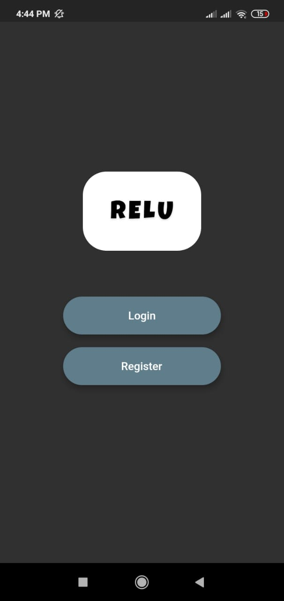
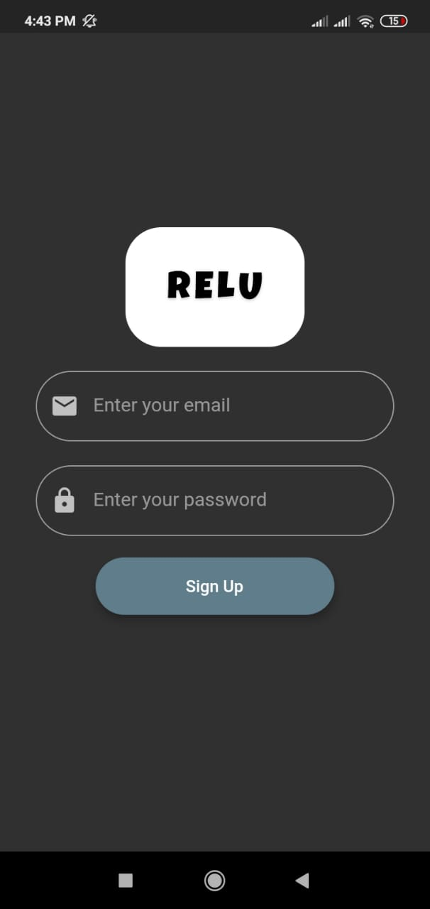
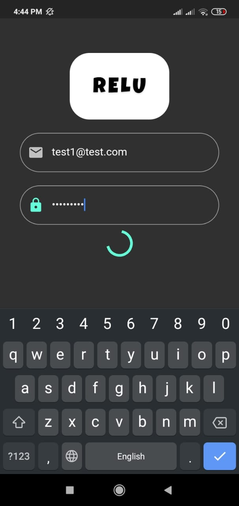
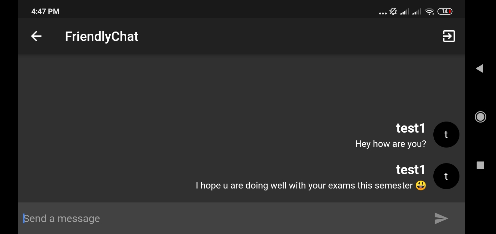
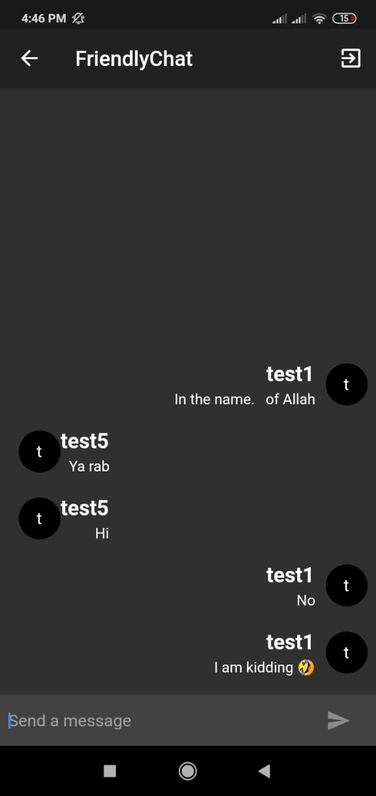
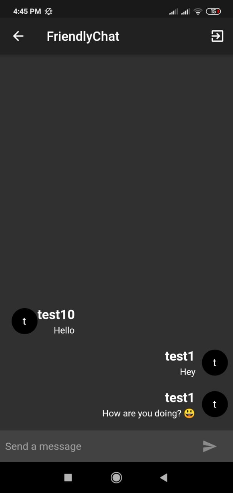
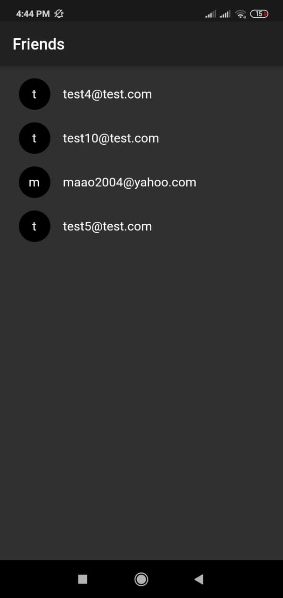

This project is a chat application developed using Flutter + Firebase for the backend.

The application consists of 3 screens: 
* Main screen.

* Sign up screen.

* Sign in screen.

* Chat screen which is a one to one chat in a landscape and portrait mode.

* Friends screen which is a list of the user's friends.

